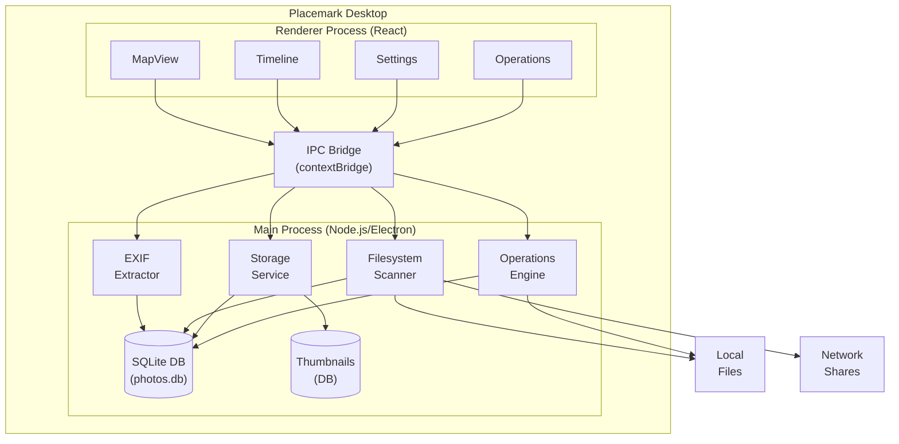
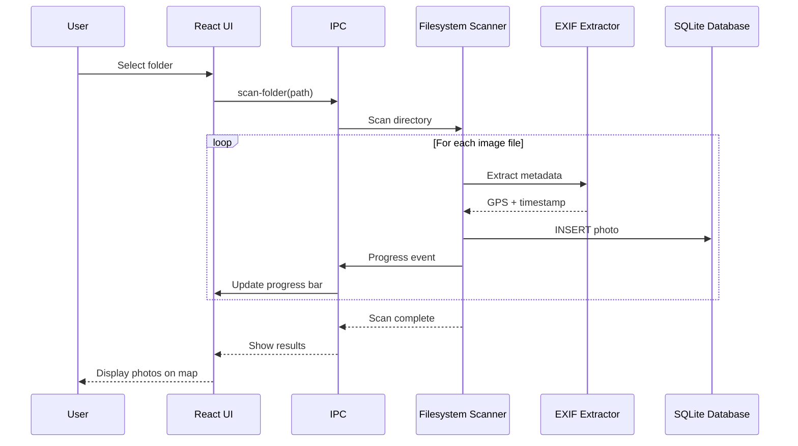
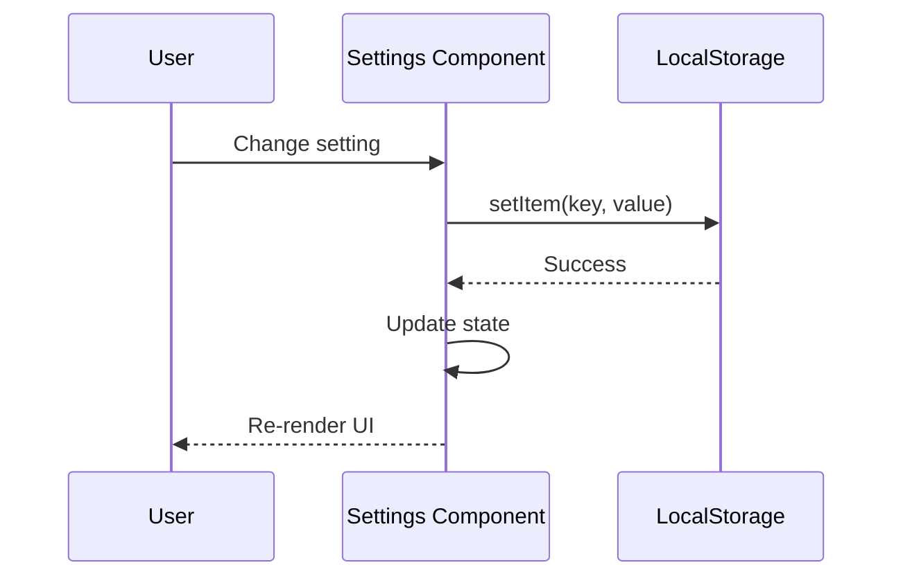

# Placemark Architecture

This document provides a comprehensive overview of Placemark's architecture, design decisions, and key patterns.

## Table of Contents

- [High-Level Architecture](#high-level-architecture)
- [Technology Stack](#technology-stack)
- [Project Structure](#project-structure)
- [Core Principles](#core-principles)
- [Data Flow](#data-flow)
- [Key Components](#key-components)
- [State Management](#state-management)
- [Performance Considerations](#performance-considerations)
- [Security Model](#security-model)

## High-Level Architecture

Placemark is built as an **Electron desktop application** with a **React frontend** and a **monorepo structure** designed for future mobile support.



## Technology Stack

### Frontend (Renderer Process)

- **React** 18+ - UI framework
- **TypeScript** 5+ - Type safety
- **MapLibre GL JS** - Map rendering (OSS alternative to Mapbox)
- **Vite** - Build tool and dev server

### Backend (Main Process)

- **Electron** 40+ - Cross-platform desktop framework
- **better-sqlite3** - Fast, synchronous SQLite bindings
- **exifr** - EXIF metadata extraction
- **sharp** - Image processing (thumbnails)

### Build & Development

- **pnpm** - Fast, disk-efficient package manager
- **pnpm workspaces** - Monorepo management
- **electron-builder** - Application packaging

## Project Structure

```
placemark/
├── packages/
│   ├── core/                      # Platform-agnostic logic
│   │   └── src/
│   │       ├── models/            # Data models (Photo, Source, Operation)
│   │       ├── filters/           # Geographic/temporal filtering
│   │       ├── operations/        # File operation logic
│   │       └── storage/           # Storage interface definitions
│   │
│   └── desktop/                   # Electron desktop app
│       └── src/
│           ├── main/              # Main process (Node.js)
│           │   ├── database/      # SQLite schema & migrations
│           │   ├── ipc/           # IPC handler registration
│           │   └── services/      # Business logic services
│           │       ├── exif.ts
│           │       ├── filesystem.ts
│           │       ├── storage.ts
│           │       └── thumbnails.ts
│           │
│           ├── preload/           # Preload script (IPC bridge)
│           │   └── index.ts       # Exposes window.api
│           │
│           └── renderer/          # React UI
│               └── src/
│                   ├── components/    # UI components
│                   │   ├── Map/       # Map-related components
│                   │   ├── Timeline/  # Timeline components
│                   │   ├── Settings/  # Settings panels
│                   │   └── Operations/# File operations UI
│                   │
│                   ├── hooks/         # Custom React hooks
│                   │   ├── useTheme.ts
│                   │   ├── useThemeColors.ts
│                   │   └── useToast.ts
│                   │
│                   └── theme/         # Theme definitions
│
├── docs/                          # Documentation
├── scripts/                       # Build & utility scripts
└── .github/                       # GitHub config & CI
```

## Core Principles

### 1. Local-First Architecture

**All data processing happens on the user's device:**

- Photos never leave the device
- EXIF metadata stored in local SQLite database
- Thumbnails cached locally
- No cloud sync or tracking

### 2. Platform Agnostic Core

**The `packages/core` package must remain pure TypeScript:**

```typescript
// ✅ ALLOWED in core package
export interface Photo {
  id: number;
  path: string; /* ... */
}
export function filterPhotosByBounds(photos: Photo[], bounds: Bounds) {
  /* ... */
}

// ❌ FORBIDDEN in core package
import fs from 'fs'; // Node.js API
import { Database } from 'better-sqlite3'; // Native module
import maplibregl from 'maplibre-gl'; // Browser API
```

**Why:** The core package will be shared with React Native mobile apps (Phase 9+).

### 3. Explicit Over Automatic

**User controls all operations:**

- Manual scan trigger (no background scanning)
- Explicit file operations (copy/move)
- Clear preview before executing
- Reversible where possible

### 4. Privacy by Design

**No data collection:**

- No telemetry
- No crash reporting
- No analytics
- No external network calls (except map tiles)

## Data Flow

### Photo Scanning Flow



### Map Display Flow

```
┌──────────────┐     ┌──────────┐     ┌──────────┐     ┌─────────┐
│ User pans/   │────▶│  React   │────▶│   IPC    │────▶│  Main   │
│ zooms map    │     │Component │     │   Call   │     │ Process │
└──────────────┘     └──────────┘     └──────────┘     └────┬────┘
                                                              │
                         ┌────────────────────────────────────┘
                         ▼
                   ┌──────────┐     ┌──────────┐     ┌──────────┐
                   │  Core    │────▶│  SQLite  │────▶│  Photos  │
                   │ Filters  │     │  Query   │     │  Array   │
                   └──────────┘     └──────────┘     └────┬─────┘
                                                           │
                         ┌─────────────────────────────────┘
                         ▼
                   ┌──────────┐     ┌──────────┐     ┌──────────┐
                   │   IPC    │────▶│  React   │────▶│ MapLibre │
                   │ Response │     │Component │     │   Map    │
                   └──────────┘     └──────────┘     └──────────┘
```

### Settings Persistence Flow



## Key Components

### MapView Component

**Purpose:** Displays photos as markers on an interactive map.

**Key Features:**

- Clustering for performance with many photos
- Spider feature for overlapping markers
- Lasso selection mode
- Hover preview with thumbnails
- Auto-fit to bounds

**Extracted Hooks:**

- `useMapInitialization` - Map setup and lifecycle
- `useMapLayerManagement` - GeoJSON sources and layers
- `useMapEventHandlers` - Click, hover, cursor events
- `useMapHover` - Hover preview logic
- `useSpider` - Spiderfication of overlapping photos
- `useLassoSelection` - Lasso drawing and selection

### Timeline Component

**Purpose:** Displays photo distribution over time, allows filtering by date range.

**Key Features:**

- Histogram showing photo density
- Draggable range selection
- Playback mode (slideshow)
- Speed controls (week/month/6-month increments)

**Sub-components:**

- `TimelineSlider` - Main histogram and range handles
- `TimelineControls` - Play/pause and speed selector

### Settings Component

**Purpose:** Centralized configuration management.

**Extracted Panels:**

- `AppearanceSettings` - Theme toggle
- `MapDisplaySettings` - Clustering, zoom, padding
- `TimelineSettings` - Playback speed, auto-fit
- `AdvancedSettings` - Developer settings (spider, tiles)
- `StorageSettings` - Database and cache management
- `AboutSection` - App info and version

**Key Pattern:**

```typescript
// Single source of truth for defaults
export const DEFAULT_SETTINGS: AppSettings = {
  clusteringEnabled: true,
  clusterRadius: 50,
  // ...
};
```

### Operations Panel

**Purpose:** File copy/move operations with dry-run preview.

**Key Features:**

- Destination folder selection
- Dry-run preview showing source → destination
- Conflict detection
- Progress tracking

**Sub-components:**

- `SourceSummary` - Selected photos summary
- `DryRunPreview` - Preview of planned operations

### File Operations Safety Model

File operations follow a **safety-first, atomic batch** design. The goal is to never lose user data.

#### Core Principles

1. **Atomic Batches:** Either ALL files in a batch succeed, or NOTHING is modified. If file #47 of 100 fails, files #1-46 are rolled back.

2. **Never Overwrite:** Operations use `COPYFILE_EXCL` flag - if a file appears at destination between validation and execution, the operation fails safely rather than overwriting.

3. **Identical Files = Skip:** If a file with the same name AND same size exists at destination, it's treated as "already done" (skipped), not a conflict. Different size = real conflict, batch aborts.

4. **Session-Only Undo:** Completed batches can be undone until app restart. On startup, old batches are archived (no indefinite undo stacking).

#### Execution Flow

```
User selects photos → Choose destination → Preview (dry-run)
                                              ↓
                                    IPC validates each file:
                                    - Same path? → Skip
                                    - Same size at dest? → Skip (identical)
                                    - Different file at dest? → Conflict (abort)
                                    - No file at dest? → Pending (proceed)
                                              ↓
                                    User confirms → Execute
                                              ↓
                                    For each file:
                                    - Create dest directory
                                    - Copy/move with COPYFILE_EXCL
                                    - On failure: rollback all completed
                                              ↓
                                    Update DB paths (move only) → Done
```

#### Undo Behavior

- **Copy undo:** Sends copied files to OS Trash (recoverable)
- **Move undo:** Restores files to original location
- **Partial undo:** If some files can't be restored, batch stays "completed" (user must investigate)

## State Management

Placemark uses **local component state** with **React hooks**. No global state management library (Redux, MobX) is used.

### State Categories

#### 1. Local UI State

Managed by `useState` in components:

```typescript
const [selectedPhotos, setSelectedPhotos] = useState<Set<number>>(new Set());
const [isSettingsOpen, setIsSettingsOpen] = useState(false);
```

#### 2. Settings (Persisted)

Managed by `localStorage`:

```typescript
const [settings, setSettings] = useState<AppSettings>(() => {
  const saved = localStorage.getItem('placemarkSettings');
  return saved ? JSON.parse(saved) : DEFAULT_SETTINGS;
});
```

#### 3. Theme (Persisted + Context)

Managed by `useTheme` hook + context:

```typescript
const { theme, toggleTheme, colors } = useTheme();
```

#### 4. Server Data (IPC)

Fetched on-demand via IPC calls:

```typescript
const photos = await window.api.photos.getWithLocation();
```

## Performance Considerations

### 1. Map Performance

**Problem:** Rendering 10,000+ photo markers causes lag.

**Solution:**

- **Clustering:** Group nearby markers into clusters (MapLibre built-in)
- **Lazy loading:** Only render markers in viewport
- **Feature state:** Use `setFeatureState` instead of re-rendering all markers

### 2. Timeline Performance

**Problem:** Histogram calculation for large datasets.

**Solution:**

- **Pre-computed bins:** Calculate histogram server-side in SQLite
- **Debouncing:** Debounce range change events (100ms)
- **RequestAnimationFrame:** Smooth playback animation

### 3. Thumbnail Caching

**Problem:** Loading full-size photos is slow.

**Solution:**

- **Thumbnail generation:** Pre-generate 150x150px thumbnails
- **LRU cache:** Store in separate SQLite database with size limit
- **Lazy loading:** Only generate thumbnails when needed

### 4. Database Performance

**Problem:** Slow queries with large datasets.

**Solution:**

- **Indexes:** Create indexes on `latitude`, `longitude`, `timestamp`
- **Prepared statements:** Reuse compiled SQL statements
- **Batch operations:** Insert multiple photos in a single transaction

```sql
-- Indexes for fast queries
CREATE INDEX idx_photos_location ON photos(latitude, longitude);
CREATE INDEX idx_photos_timestamp ON photos(timestamp);
CREATE INDEX idx_photos_source_path ON photos(source, path);
```

## Security Model

### IPC Security

**Problem:** Renderer process should not have direct file system access.

**Solution:** Use Electron's **contextBridge** and **contextIsolation**:

```typescript
// preload/index.ts
contextBridge.exposeInMainWorld('api', {
  photos: {
    scanFolder: () => ipcRenderer.invoke('photos:scan-folder'),
    // ...
  },
});
```

**Benefits:**

- Renderer cannot access Node.js APIs
- All file operations go through validated IPC handlers
- Prevents arbitrary code execution

### Input Validation

**All user inputs are validated in main process:**

```typescript
// main/ipc/photos.ts
ipcMain.handle('photos:scan-folder', async () => {
  const result = await dialog.showOpenDialog({
    properties: ['openDirectory'],
  });

  if (result.canceled || !result.filePaths[0]) {
    return { canceled: true };
  }

  // Validate path exists and is readable
  const folderPath = result.filePaths[0];
  if (!fs.existsSync(folderPath)) {
    throw new Error('Folder does not exist');
  }

  // Proceed with scan...
});
```

### SQL Injection Prevention

**Always use prepared statements:**

```typescript
// ✅ SAFE - parameterized query
const photos = db.prepare('SELECT * FROM photos WHERE id = ?').all(photoId);

// ❌ UNSAFE - string interpolation
const photos = db.prepare(`SELECT * FROM photos WHERE id = ${photoId}`).all();
```

## Future Considerations

### Phase 9: Mobile Support

The architecture is designed to support React Native:

1. **Core package** has zero Node.js/Electron dependencies
2. **Storage interface** (`IStorage`) can be implemented with react-native-sqlite
3. **Filtering logic** works identically on mobile
4. **UI components** can be ported to React Native equivalents

### Offline Tile Caching (Phase 8)

Map tiles are currently fetched from OpenStreetMap servers. In Phase 8, we'll add:

1. **Tile cache:** Store tiles in SQLite/filesystem
2. **Progressive download:** Background tile fetching for viewed areas
3. **Fallback:** Offline mode shows cached tiles only

---

**This architecture prioritizes privacy, performance, and future portability while keeping the codebase clean and maintainable.**
