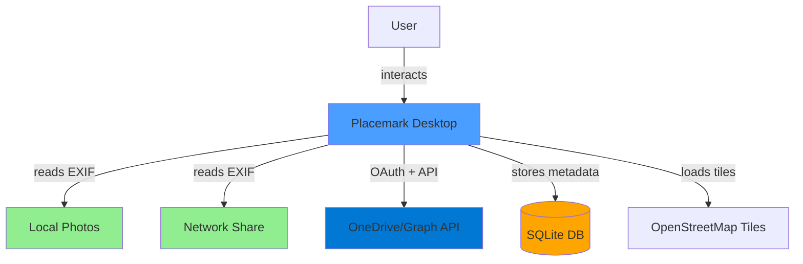
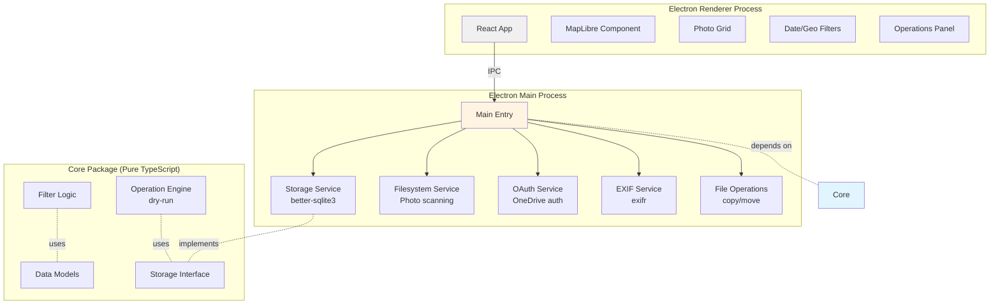
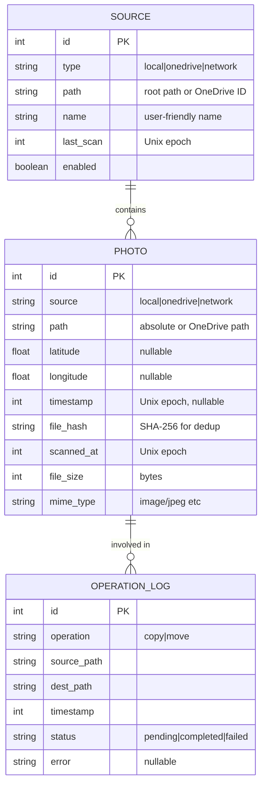

# Placemark — Implementation Plan

This document outlines the architecture, technology decisions, and step-by-step implementation plan for Placemark.

## Technology Decision Matrices

### 1. Application Framework

| Framework | Filesystem Access | OAuth Support | Cross-Platform | SQLite | EXIF Libraries | Bundle Size | Mobile Path | Score |
|-----------|------------------|---------------|----------------|--------|----------------|-------------|-------------|-------|
| **Electron (Desktop)** | ✅ Full | ✅ localhost redirect | ✅ Win/Mac/Linux | ✅ better-sqlite3 | ✅ exifr | ⚠️ Large (~100MB) | ✅ + React Native | **9/10** |
| Tauri | ✅ Full | ⚠️ Complex | ✅ Win/Mac/Linux | ✅ rusqlite | ⚠️ Limited | ✅ Small (~10MB) | ❌ No mobile | 6/10 |
| Web (PWA) | ❌ File System API limited | ⚠️ Needs backend | ✅ Any browser | ❌ IndexedDB only | ⚠️ Limited | ✅ Tiny | ✅ Yes | 4/10 |
| React Native | ⚠️ Limited desktop | ⚠️ Complex | ⚠️ Mobile-first | ⚠️ SQLite plugins | ⚠️ Limited | ✅ Small | ✅ Native | 5/10 |

**Decision: Electron for Desktop, React Native for Mobile (future)**
- Reason: Full filesystem access is non-negotiable for local/network folders on desktop
- OAuth can work via localhost redirect (no backend needed) on desktop
- Mature ecosystem for photo/EXIF processing
- TypeScript throughout, React for UI (shared with React Native)
- **Mobile strategy:** Shared `core` package (pure TypeScript), separate `mobile` package with React Native
- Trade-off: Larger desktop bundle acceptable; mobile will be ~20-30MB

### 2. Map Library

| Library | Open Source | Offline Capable | Performance | Vector Tiles | License | Monthly Cost | Score |
|---------|------------|-----------------|-------------|--------------|---------|--------------|-------|
| **MapLibre GL JS** | ✅ Yes | ✅ Yes | ✅ Excellent | ✅ Yes | ✅ BSD | ✅ $0 | **10/10** |
| Leaflet | ✅ Yes | ✅ Yes | ⚠️ Good | ❌ Raster only | ✅ BSD | ✅ $0 | 7/10 |
| Google Maps | ❌ No | ❌ No | ✅ Excellent | ✅ Yes | ❌ Proprietary | ❌ $200+ | 3/10 |
| Mapbox GL JS | ⚠️ Proprietary v2+ | ✅ Yes | ✅ Excellent | ✅ Yes | ❌ Proprietary | ❌ $50+ | 5/10 |

**Decision: MapLibre GL JS**
- Reason: Open source fork of Mapbox (pre-proprietary)
- Free OpenStreetMap tiles available
- Can cache tiles locally (privacy + offline)
- No API keys or usage tracking required
- Aligns with "tool not service" philosophy

### 3. EXIF Processing Library

| Library | Speed | Format Support | Streaming | Bundle Size | GPS Parsing | TypeScript | Score |
|---------|-------|----------------|-----------|-------------|-------------|------------|-------|
| **exifr** | ✅ Very fast | ✅ All common | ✅ Yes | ✅ 50KB | ✅ Yes | ✅ Native | **10/10** |
| exif-parser | ⚠️ Moderate | ⚠️ Limited | ❌ No | ✅ 30KB | ✅ Yes | ⚠️ .d.ts only | 6/10 |
| exiftool (CLI) | ✅ Fast | ✅ Everything | ❌ No | ❌ 12MB Perl | ✅ Yes | ❌ No | 5/10 |
| piexifjs | ⚠️ Slow | ⚠️ Basic | ❌ No | ✅ 40KB | ⚠️ Manual | ❌ No | 4/10 |

**Decision: exifr**
- Reason: Best performance + TypeScript native
- Streaming support for large files
- Pick specific fields (GPS + DateTimeOriginal only)
- Actively maintained, comprehensive format support

### 4. Local Storage/Database

| Solution | Performance | Query Capability | Transactions | Electron Support | Mobile Support | Cross-Platform | Score |
|----------|-------------|------------------|-------------|------------------|----------------|----------------|-------|
| **SQLite** | ✅ Excellent | ✅ SQL | ✅ Yes | ✅ better-sqlite3 | ✅ react-native-sqlite | ✅ Yes | **10/10** |
| SQLite (sql.js) | ⚠️ Good | ✅ SQL | ✅ Yes | ✅ WASM | ⚠️ Limited | ✅ Yes | 7/10 |
| IndexedDB | ⚠️ Moderate | ⚠️ Limited | ⚠️ Complex | ✅ Yes | ❌ No | ❌ Web only | 4/10 |
| JSON files | ❌ Poor | ❌ Manual | ❌ No | ✅ Yes | ✅ Yes | ✅ Yes | 3/10 |

**Decision: SQLite with platform-specific drivers**
- Desktop: `better-sqlite3` (native Node.js module, sync I/O)
- Mobile (future): `react-native-sqlite-storage` or `expo-sqlite`
- Reason: Spatial queries (lat/lon ranges) are fast
- Transactions ensure consistency
- Proven at scale (millions of records)
- Can use R*Tree index for geographic queries
- **Critical:** Core package defines storage interface, platform packages implement it

### 5. UI Framework

| Framework | TypeScript | Component Ecosystem | Learning Curve | Desktop Patterns | Size | Score |
|-----------|-----------|---------------------|----------------|------------------|------|-------|
| **React** | ✅ Excellent | ✅ Vast | ✅ Moderate | ✅ Good | ⚠️ Medium | **9/10** |
| Svelte | ✅ Good | ⚠️ Growing | ✅ Easy | ⚠️ Limited | ✅ Small | 7/10 |
| Vue | ✅ Good | ✅ Large | ✅ Easy | ⚠️ Limited | ⚠️ Medium | 7/10 |
| Vanilla TS | ✅ Perfect | ❌ None | ⚠️ Hard | ⚠️ Manual | ✅ Tiny | 5/10 |

**Decision: React + Tailwind CSS**
- Reason: MapLibre has React wrappers (react-map-gl)
- Large component ecosystem for common patterns
- Team familiarity likely
- Tailwind keeps UI code minimal and readable

### 6. Package Manager

| Manager | Speed | Workspaces | Disk Efficiency | Lockfile | Electron Compatible | Score |
|---------|-------|------------|-----------------|----------|---------------------|-------|
| **pnpm** | ✅ Fastest | ✅ Yes | ✅ Excellent (hardlinks) | ✅ Yes | ✅ Yes | **10/10** |
| npm | ⚠️ Slow | ✅ Yes | ⚠️ Moderate | ✅ Yes | ✅ Yes | 6/10 |
| yarn | ✅ Fast | ✅ Yes | ⚠️ Moderate | ✅ Yes | ✅ Yes | 7/10 |

**Decision: pnpm**
- Reason: Fast installs, efficient disk usage
- Native workspace support for monorepo
- Strict dependency resolution (no phantom deps)

## Architecture Principles for Multi-Platform

### Key Constraints

1. **Core package must be pure TypeScript** - no Node.js APIs, no DOM APIs, no native modules
2. **All I/O goes through interfaces** - filesystem, storage, network are abstracted
3. **Platform packages implement interfaces** - desktop uses Node.js fs, mobile uses react-native modules
4. **Shared business logic** - filtering, validation, operation planning in core
5. **Platform-specific UI** - React for desktop (Electron), React Native for mobile

### Mobile Considerations

**Desktop (Electron) has:**
- Full filesystem access (local folders, network shares, UNC paths)
- Synchronous SQLite (better-sqlite3)
- OAuth via localhost redirect
- Direct file operations (copy/move)

**Mobile (React Native) will have:**
- Sandboxed filesystem (user must grant access per folder/photo)
- Async SQLite (react-native-sqlite-storage)
- OAuth via deep links or embedded webview
- Limited file operations (use system photo library APIs)
- OneDrive likely the primary source (not local folders)

**Shared core handles:**
- Data models (Photo, Source, Filter, Operation)
- Filter logic (geographic bounds, date ranges, combinations)
- Operation planning (dry-run, validation, conflict detection)
- Query building (SQL generation, parameter binding)

### System Context



### Component Architecture



### Data Model



## Project Structure

```
placemark/
├── .github/
│   └── copilot-instructions.md
├── packages/
│   ├── core/                          # Pure TypeScript, NO platform dependencies
│   │   ├── src/
│   │   │   ├── models/
│   │   │   │   ├── Photo.ts           # Photo type definition
│   │   │   │   ├── Source.ts          # Source type definition
│   │   │   │   ├── Filter.ts          # Filter types
│   │   │   │   └── Operation.ts       # Operation types
│   │   │   ├── filters/
│   │   │   │   ├── geographic.ts      # Bounding box logic
│   │   │   │   ├── temporal.ts        # Date range logic
│   │   │   │   └── combined.ts        # Combined filter
│   │   │   ├── storage/
│   │   │   │   ├── IStorage.ts        # Storage interface
│   │   │   │   └── queries.ts         # Query builders
│   │   │   └── operations/
│   │   │       ├── engine.ts          # Operation engine
│   │   │       ├── dryrun.ts          # Dry-run preview
│   │   │       └── validator.ts       # Path validation
│   │   ├── package.json
│   │   └── tsconfig.json
│   │
│   ├── desktop/                       # Electron application
│   │   ├── src/
│   │   │   ├── main/                  # Main process (Node.js)
│   │   │   │   ├── index.ts           # Entry point
│   │   │   │   ├── window.ts          # BrowserWindow setup
│   │   │   │   ├── ipc/               # IPC handlers
│   │   │   │   │   ├── photos.ts
│   │   │   │   │   ├── sources.ts
│   │   │   │   │   ├── operations.ts
│   │   │   │   │   └── auth.ts
│   │   │   │   ├── services/
│   │   │   │   │   ├── storage.ts     # better-sqlite3 implementation
│   │   │   │   │   ├── filesystem.ts  # Node.js fs for local/network
│   │   │   │   │   ├── exif.ts        # exifr extraction
│   │   │   │   │   ├── onedrive.ts    # OneDrive Graph API
│   │   │   │   │   └── oauth.ts       # OAuth localhost flow
│   │   │   │   └── database/
│   │   │   │       ├── migrations/    # Schema versions
│   │   │   │       │   └── 001-initial.sql
│   │   │   │       └── schema.sql
│   │   │
│   │   │   ├── renderer/              # Renderer process (React)
│   │   │   │   ├── src/
│   │   │   │   │   ├── App.tsx
│   │   │   │   │   ├── main.tsx
│   │   │   │   │   ├── components/
│   │   │   │   │   │   ├── Map/
│   │   │   │   │   │   │   ├── MapView.tsx
│   │   │   │   │   │   │   ├── PhotoMarkers.tsx
│   │   │   │   │   │   │   └── SelectionBox.tsx
│   │   │   │   │   │   ├── PhotoGrid/
│   │   │   │   │   │   │   ├── PhotoGrid.tsx
│   │   │   │   │   │   │   ├── PhotoCard.tsx
│   │   │   │   │   │   │   └── VirtualScroller.tsx
│   │   │   │   │   │   ├── Filters/
│   │   │   │   │   │   │   ├── DateRangeSlider.tsx
│   │   │   │   │   │   │   ├── SourceSelector.tsx
│   │   │   │   │   │   │   └── SelectionSummary.tsx
│   │   │   │   │   │   ├── Operations/
│   │   │   │   │   │   │   ├── OperationsPanel.tsx
│   │   │   │   │   │   │   ├── DryRunPreview.tsx
│   │   │   │   │   │   │   └── ProgressBar.tsx
│   │   │   │   │   │   └── Settings/
│   │   │   │   │   │       ├── SourcesManager.tsx
│   │   │   │   │   │       └── OneDriveAuth.tsx
│   │   │   │   │   ├── hooks/
│   │   │   │   │   │   ├── usePhotos.ts
│   │   │   │   │   │   ├── useFilters.ts
│   │   │   │   │   │   └── useIPC.ts
│   │   │   │   │   └── styles/
│   │   │   │   │       └── globals.css
│   │   │   │   ├── index.html
│   │   │   │   └── vite.config.ts
│   │   │   │
│   │   │   └── preload/               # Preload script
│   │   │       └── index.ts           # IPC bridge (contextBridge)
│   │   │
│   │   ├── electron-builder.yml
│   │   ├── package.json
│   │   └── tsconfig.json
│   │
│   └── mobile/                        # React Native (FUTURE - Phase 9+)
│       ├── src/
│       │   ├── App.tsx
│       │   ├── services/
│       │   │   ├── storage.ts         # react-native-sqlite implementation
│       │   │   ├── photolibrary.ts    # expo-media-library or similar
│       │   │   ├── onedrive.ts        # Graph API (same as desktop)
│       │   │   └── oauth.ts           # Deep link OAuth flow
│       │   ├── screens/
│       │   │   ├── MapScreen.tsx
│       │   │   ├── PhotoGridScreen.tsx
│       │   │   └── SettingsScreen.tsx
│       │   └── components/            # Mobile-specific components
│       ├── ios/                       # iOS project
│       ├── android/                   # Android project
│       ├── app.json                   # Expo config (if using Expo)
│       └── package.json
│
├── plan.md                            # This file
├── projectgoal.md
├── README.md
├── pnpm-workspace.yaml
└── package.json                       # Root workspace config
```

## Implementation Phases

### Phase 0: Project Setup (Week 1)

**Goal:** Establish monorepo, build system, and basic Electron shell.

**Tasks:**
1. Initialize pnpm workspace
2. Create `packages/core` with TypeScript config
3. Create `packages/desktop` with Electron + Vite
4. Set up build scripts and hot reload
5. Create basic window with "Hello World"

**Testing:**
- [ ] `pnpm install` works
- [ ] `pnpm -C packages/desktop dev` launches Electron window
- [ ] Hot reload works for renderer changes
- [ ] TypeScript compilation succeeds

**Deliverable:** Empty Electron app that opens a window.

---

### Phase 1: Local File Scanning + EXIF (Week 2-3)

**Goal:** Scan a local folder, extract EXIF GPS + timestamps, store in SQLite.

**Tasks:**
1. Create SQLite schema (photos table)
2. Implement `packages/core/src/models/Photo.ts`
3. Implement `packages/desktop/src/main/services/storage.ts` (SQLite)
4. Implement `packages/desktop/src/main/services/exif.ts` (exifr)
5. Implement `packages/desktop/src/main/services/filesystem.ts` (recursive scan)
6. Create IPC handler for "scan folder"
7. Add basic UI: folder picker + "Scan" button
8. Display count of photos found with GPS

**Testing:**
- [ ] Can select folder via native dialog
- [ ] Scans recursively for JPG/PNG/HEIC files
- [ ] Extracts GPS coordinates correctly (test with known photos)
- [ ] Stores in SQLite with correct schema
- [ ] UI shows count: "152 photos with location data"
- [ ] Re-scanning same folder updates existing records (no duplicates)

**Deliverable:** Can scan local folder and see count of geotagged photos.

---

### Phase 2: Map Display (Week 4)

**Goal:** Display photos as markers on a map using MapLibre.

**Tasks:**
1. Add MapLibre GL JS to renderer
2. Configure OpenStreetMap tile source
3. Create `MapView.tsx` component
4. Create IPC handler for "get photos in bounds"
5. Implement `packages/core/src/filters/geographic.ts`
6. Query SQLite with bounding box
7. Render markers on map (clustered if needed)
8. Click marker → show photo thumbnail

**Testing:**
- [ ] Map loads with OpenStreetMap tiles
- [ ] Photo markers appear in correct locations
- [ ] Clicking marker shows photo preview
- [ ] Panning/zooming updates visible markers
- [ ] Performance: 10,000 photos render without lag (use clustering)
- [ ] Works offline with cached tiles

**Deliverable:** Interactive map showing photos as markers.

---

### Phase 3: Temporal Filtering (Week 5)

**Goal:** Add date range slider to filter photos by time.

**Tasks:**
1. Implement `packages/core/src/filters/temporal.ts`
2. Create `DateRangeSlider.tsx` component
3. Query SQLite for min/max timestamps
4. Add timestamp index to database
5. Combine geographic + temporal filters
6. Update marker display based on both filters
7. Show selection summary: "87 photos (Jan 2023 - Mar 2023, Paris area)"

**Testing:**
- [ ] Slider shows correct date range from data
- [ ] Moving slider filters photos in real-time
- [ ] Combining map bounds + date range works correctly
- [ ] Edge cases: no dates, partial dates, future dates
- [ ] Performance: filter 10,000 photos in <100ms

**Deliverable:** Can filter photos by both location and date.

---

### Phase 4: File Operations - Dry Run (Week 6)

**Goal:** Preview copy/move operations without executing.

**Tasks:**
1. Create `OperationsPanel.tsx` component
2. Implement `packages/core/src/operations/dryrun.ts`
3. Add UI: destination folder picker, operation type (copy/move)
4. Generate preview: source → destination paths
5. Show warnings: overwrite conflicts, disk space check
6. Implement `packages/core/src/operations/validator.ts`
7. Add "Execute" and "Cancel" buttons (Execute disabled for now)

**Testing:**
- [ ] Preview shows correct source → destination mappings
- [ ] Detects filename conflicts
- [ ] Warns if destination has insufficient space
- [ ] Validates destination path is writable
- [ ] Shows operation count and total size
- [ ] Cancel clears preview

**Deliverable:** Can preview file operations but not execute yet.

---

### Phase 5: File Operations - Execution (Week 7)

**Goal:** Actually copy/move files with progress tracking.

**Tasks:**
1. Implement `packages/core/src/operations/engine.ts`
2. Add operation_log table to database
3. Create progress bar UI with cancel button
4. Implement file copy/move in main process
5. Stream progress updates via IPC
6. Handle errors gracefully (log, skip, retry)
7. Transaction support: mark operations as pending/completed/failed

**Testing:**
- [ ] Copy operation creates files in destination
- [ ] Move operation removes source files
- [ ] Progress bar updates smoothly
- [ ] Cancel mid-operation stops cleanly
- [ ] Failed operations are logged with errors
- [ ] No partial/corrupted files on failure
- [ ] Can retry failed operations

**Deliverable:** Fully functional file copy/move.

---

### Phase 6: Network Shares (Week 8)

**Goal:** Support network-mounted folders (e.g., NAS).

**Tasks:**
1. Add "Network Share" source type
2. Handle UNC paths on Windows (\\server\share)
3. Handle SMB/NFS mounts on macOS/Linux
4. Test with slow network connections
5. Add retry logic for network timeouts
6. Cache scanned metadata (don't re-scan network on every launch)

**Testing:**
- [ ] Can scan network share via UNC path
- [ ] Handles network disconnection gracefully
- [ ] Performance acceptable on slow networks
- [ ] Cached metadata works when network unavailable

**Deliverable:** Network shares work like local folders.

---

### Phase 7: OneDrive Integration (Week 9-11)

**Goal:** Scan OneDrive photos via Microsoft Graph API.

**Tasks:**
1. Register app in Azure AD Portal
2. Implement OAuth flow with localhost redirect
3. Implement `packages/desktop/src/main/services/oauth.ts`
4. Implement `packages/desktop/src/main/services/onedrive.ts`
5. Paginate through OneDrive photos (Graph API)
6. Download EXIF metadata (no full file download)
7. Store with source='onedrive', path=OneDrive item ID
8. Add "Connect OneDrive" button in settings
9. Refresh token handling

**Testing:**
- [ ] OAuth flow completes successfully
- [ ] Can list OneDrive photos
- [ ] EXIF data extracted without downloading full files
- [ ] Tokens stored securely (safeStorage API)
- [ ] Token refresh works automatically
- [ ] Handles OneDrive API rate limits

**Deliverable:** OneDrive photos appear on map alongside local photos.

---

### Phase 8: Polish & Performance (Week 12-13)

**Goal:** Production-ready quality.

**Tasks:**
1. Virtual scrolling for photo grid (handle 100k+ photos)
2. Map marker clustering (performance)
3. Incremental folder scanning (only new files)
4. File hash deduplication (same photo in multiple sources)
5. Settings: cache location, map tile source, scan schedule
6. Error boundary and crash reporting
7. User documentation (help screen)
8. Packaging with electron-builder (Windows .exe, macOS .dmg)

**Testing:**
- [ ] Performance with 100,000 photos
- [ ] Memory usage stays reasonable (<500MB)
- [ ] App launches in <3 seconds
- [ ] All features work in packaged app
- [ ] Installation on fresh machine works

**Deliverable:** Installable desktop application.

---

## Development Commands

```bash
# Install dependencies
pnpm install

# Core package (types, logic)
pnpm -C packages/core build
pnpm -C packages/core test

# Desktop app development
pnpm -C packages/desktop dev          # Hot reload
pnpm -C packages/desktop build        # Production build
pnpm -C packages/desktop package      # Create installer

# All packages
pnpm -r build                          # Build all
pnpm -r test                           # Test all
```

## Testing Strategy

**Unit Tests (Vitest):**
- Core package: filter logic, query builders, validation
- Run fast (<1s), no I/O

**Integration Tests:**
- EXIF extraction with sample photos
- SQLite queries with test database
- File operations in temp directory

**E2E Tests (Playwright):**
- Full app workflow: scan → filter → preview → execute
- OneDrive OAuth flow (mock Graph API)

**Manual Testing:**
- Test with user's actual photo library (performance)
- Network disconnection scenarios
- Cross-platform (Windows, macOS)

## Risk Mitigation

| Risk | Likelihood | Impact | Mitigation |
|------|-----------|--------|------------|
| OneDrive API rate limits | High | Medium | Cache metadata locally, batch requests |
| Large photo libraries (100k+) | Medium | High | Virtual scrolling, incremental scans, indexing |
| EXIF parsing errors | Medium | Medium | Graceful fallback, log errors, continue scan |
| File operation failures | Medium | High | Transactional operations, dry-run preview |
| Map tile availability | Low | Medium | Cache tiles locally, fallback tile source |
| OAuth token expiry | High | Low | Auto-refresh, clear error messaging |

## Success Metrics

**Phase 1-3 (MVP):**
- Scan 10,000 photos in <30 seconds
- Map renders 10,000 markers with clustering
- Filter 10,000 photos in <100ms

**Phase 7 (OneDrive):**
- Connect to OneDrive in <30 seconds
- Scan 1,000 OneDrive photos in <2 minutes

**Phase 8 (Production):**
- Handle 100,000 photos without performance degradation
- Package size <150MB
- Cold start <3 seconds

## Mobile Roadmap (Post-Phase 8)

### Phase 9: Mobile Foundation (Future)

**Goal:** Port core logic to React Native, basic photo display.

**Tasks:**
1. Create `packages/mobile` with React Native
2. Implement mobile storage service (react-native-sqlite-storage)
3. Implement photo library access (expo-media-library)
4. Extract EXIF from device photos
5. Display photos on map using react-native-maplibre
6. OneDrive OAuth via deep links

**Key Differences from Desktop:**
- No direct filesystem access (must use photo library APIs)
- All I/O is asynchronous
- Limited file operations (can't copy to arbitrary folders)
- OneDrive likely primary source on mobile
- Need location permissions from OS
- No network share support

**Testing:**
- [ ] Can access device photo library
- [ ] EXIF extraction works on iOS and Android
- [ ] Map displays with device photos
- [ ] OneDrive auth flow works on mobile
- [ ] App size <30MB

**Deliverable:** Mobile app showing device photos on map.

---

## Core Package Guidelines (Critical for Mobile Compatibility)

### ✅ Allowed in `packages/core`:

- Pure TypeScript types and interfaces
- Business logic (filtering, validation, query building)
- Data transformations and calculations
- Constants and configuration
- Abstract interfaces for I/O (IStorage, IFileSystem, etc.)

### ❌ Forbidden in `packages/core`:

- `import fs from 'fs'` or any Node.js APIs
- `import { Database } from 'better-sqlite3'` or native modules
- `document`, `window`, or browser APIs
- File path manipulation using `path` module (use string operations)
- Any async I/O operations (delegate to platform packages)

### Example: Geographic Filter (Good)

```typescript
// packages/core/src/filters/geographic.ts
export interface BoundingBox {
  north: number;
  south: number;
  east: number;
  west: number;
}

export function isPhotoInBounds(
  photo: { latitude: number; longitude: number },
  bounds: BoundingBox
): boolean {
  return (
    photo.latitude >= bounds.south &&
    photo.latitude <= bounds.north &&
    photo.longitude >= bounds.west &&
    photo.longitude <= bounds.east
  );
}

export function buildBoundsQuery(bounds: BoundingBox): {
  sql: string;
  params: number[];
} {
  return {
    sql: 'WHERE latitude BETWEEN ? AND ? AND longitude BETWEEN ? AND ?',
    params: [bounds.south, bounds.north, bounds.west, bounds.east]
  };
}
```

This works on desktop (Electron), mobile (React Native), and even web (future).

---

## Next Steps

1. Review this plan for alignment with project goals and mobile future
2. Clarify any unclear decisions
3. Begin Phase 0: Project setup (desktop-first, mobile-ready architecture)
4. Establish testing practices from Phase 1 onwards
5. Keep mobile compatibility in mind during Phases 1-8
