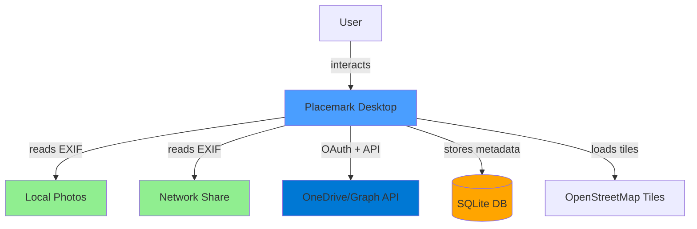
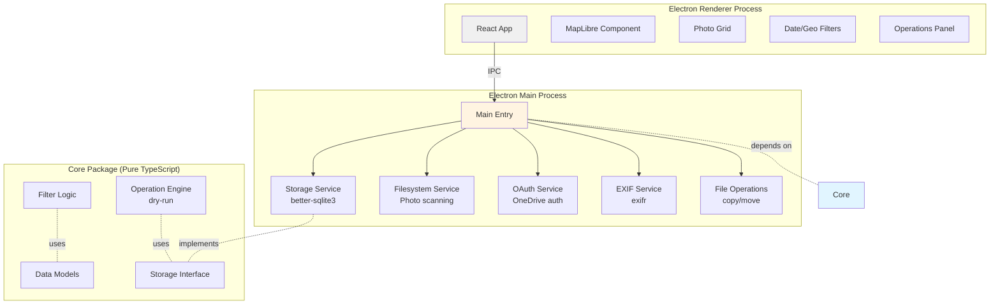
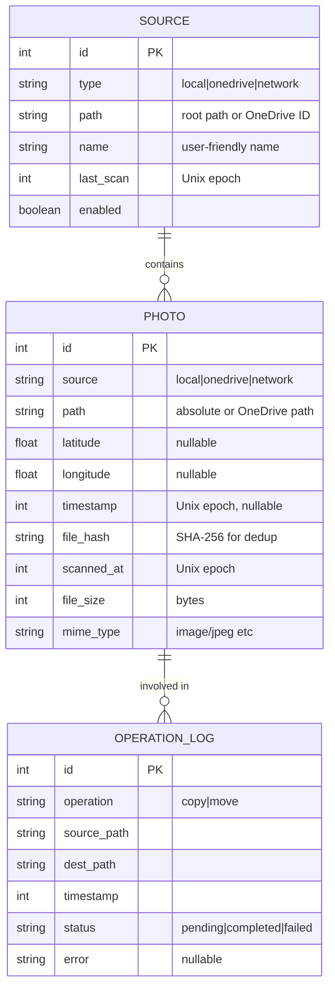

# Placemark — Technology Decisions

This document contains the decision matrices and architecture details that informed the implementation plan.

## Technology Decision Matrices

### 1. Application Framework

| Framework              | Filesystem Access          | OAuth Support         | Cross-Platform   | SQLite            | EXIF Libraries | Bundle Size       | Mobile Path       | Score    |
| ---------------------- | -------------------------- | --------------------- | ---------------- | ----------------- | -------------- | ----------------- | ----------------- | -------- |
| **Electron (Desktop)** | ✅ Full                    | ✅ localhost redirect | ✅ Win/Mac/Linux | ✅ better-sqlite3 | ✅ exifr       | ⚠️ Large (~100MB) | ✅ + React Native | **9/10** |
| Tauri                  | ✅ Full                    | ⚠️ Complex            | ✅ Win/Mac/Linux | ✅ rusqlite       | ⚠️ Limited     | ✅ Small (~10MB)  | ❌ No mobile      | 6/10     |
| Web (PWA)              | ❌ File System API limited | ⚠️ Needs backend      | ✅ Any browser   | ❌ IndexedDB only | ⚠️ Limited     | ✅ Tiny           | ✅ Yes            | 4/10     |
| React Native           | ⚠️ Limited desktop         | ⚠️ Complex            | ⚠️ Mobile-first  | ⚠️ SQLite plugins | ⚠️ Limited     | ✅ Small          | ✅ Native         | 5/10     |

**Decision: Electron for Desktop, React Native for Mobile (future)**

- Reason: Full filesystem access is non-negotiable for local/network folders on desktop
- OAuth can work via localhost redirect (no backend needed) on desktop
- Mature ecosystem for photo/EXIF processing
- TypeScript throughout, React for UI (shared with React Native)
- **Mobile strategy:** Shared `core` package (pure TypeScript), separate `mobile` package with React Native
- Trade-off: Larger desktop bundle acceptable; mobile will be ~20-30MB

### 2. Map Library

| Library            | Open Source        | Offline Capable | Performance  | Vector Tiles   | License        | Monthly Cost | Score     |
| ------------------ | ------------------ | --------------- | ------------ | -------------- | -------------- | ------------ | --------- |
| **MapLibre GL JS** | ✅ Yes             | ✅ Yes          | ✅ Excellent | ✅ Yes         | ✅ BSD         | ✅ $0        | **10/10** |
| Leaflet            | ✅ Yes             | ✅ Yes          | ⚠️ Good      | ❌ Raster only | ✅ BSD         | ✅ $0        | 7/10      |
| Google Maps        | ❌ No              | ❌ No           | ✅ Excellent | ✅ Yes         | ❌ Proprietary | ❌ $200+     | 3/10      |
| Mapbox GL JS       | ⚠️ Proprietary v2+ | ✅ Yes          | ✅ Excellent | ✅ Yes         | ❌ Proprietary | ❌ $50+      | 5/10      |

**Decision: MapLibre GL JS**

- Reason: Open source fork of Mapbox (pre-proprietary)
- Free OpenStreetMap tiles available
- Can cache tiles locally (privacy + offline)
- No API keys or usage tracking required
- Aligns with "tool not service" philosophy

### 3. EXIF Processing Library

| Library        | Speed        | Format Support | Streaming | Bundle Size  | GPS Parsing | TypeScript    | Score     |
| -------------- | ------------ | -------------- | --------- | ------------ | ----------- | ------------- | --------- |
| **exifr**      | ✅ Very fast | ✅ All common  | ✅ Yes    | ✅ 50KB      | ✅ Yes      | ✅ Native     | **10/10** |
| exif-parser    | ⚠️ Moderate  | ⚠️ Limited     | ❌ No     | ✅ 30KB      | ✅ Yes      | ⚠️ .d.ts only | 6/10      |
| exiftool (CLI) | ✅ Fast      | ✅ Everything  | ❌ No     | ❌ 12MB Perl | ✅ Yes      | ❌ No         | 5/10      |
| piexifjs       | ⚠️ Slow      | ⚠️ Basic       | ❌ No     | ✅ 40KB      | ⚠️ Manual   | ❌ No         | 4/10      |

**Decision: exifr**

- Reason: Best performance + TypeScript native
- Streaming support for large files
- Pick specific fields (GPS + DateTimeOriginal only)
- Actively maintained, comprehensive format support

### 4. Local Storage/Database

| Solution        | Performance  | Query Capability | Transactions | Electron Support  | Mobile Support         | Cross-Platform | Score     |
| --------------- | ------------ | ---------------- | ------------ | ----------------- | ---------------------- | -------------- | --------- |
| **SQLite**      | ✅ Excellent | ✅ SQL           | ✅ Yes       | ✅ better-sqlite3 | ✅ react-native-sqlite | ✅ Yes         | **10/10** |
| SQLite (sql.js) | ⚠️ Good      | ✅ SQL           | ✅ Yes       | ✅ WASM           | ⚠️ Limited             | ✅ Yes         | 7/10      |
| IndexedDB       | ⚠️ Moderate  | ⚠️ Limited       | ⚠️ Complex   | ✅ Yes            | ❌ No                  | ❌ Web only    | 4/10      |
| JSON files      | ❌ Poor      | ❌ Manual        | ❌ No        | ✅ Yes            | ✅ Yes                 | ✅ Yes         | 3/10      |

**Decision: SQLite with platform-specific drivers**

- Desktop: `better-sqlite3` (native Node.js module, sync I/O)
- Mobile (future): `react-native-sqlite-storage` or `expo-sqlite`
- Reason: Spatial queries (lat/lon ranges) are fast
- Transactions ensure consistency
- Proven at scale (millions of records)
- Can use R\*Tree index for geographic queries
- **Critical:** Core package defines storage interface, platform packages implement it

### 5. UI Framework

| Framework  | TypeScript   | Component Ecosystem | Learning Curve | Desktop Patterns | Size      | Score    |
| ---------- | ------------ | ------------------- | -------------- | ---------------- | --------- | -------- |
| **React**  | ✅ Excellent | ✅ Vast             | ✅ Moderate    | ✅ Good          | ⚠️ Medium | **9/10** |
| Svelte     | ✅ Good      | ⚠️ Growing          | ✅ Easy        | ⚠️ Limited       | ✅ Small  | 7/10     |
| Vue        | ✅ Good      | ✅ Large            | ✅ Easy        | ⚠️ Limited       | ⚠️ Medium | 7/10     |
| Vanilla TS | ✅ Perfect   | ❌ None             | ⚠️ Hard        | ⚠️ Manual        | ✅ Tiny   | 5/10     |

**Decision: React + Tailwind CSS**

- Reason: MapLibre has React wrappers (react-map-gl)
- Large component ecosystem for common patterns
- Team familiarity likely
- Tailwind keeps UI code minimal and readable

### 6. Package Manager

| Manager  | Speed      | Workspaces | Disk Efficiency          | Lockfile | Electron Compatible | Score     |
| -------- | ---------- | ---------- | ------------------------ | -------- | ------------------- | --------- |
| **pnpm** | ✅ Fastest | ✅ Yes     | ✅ Excellent (hardlinks) | ✅ Yes   | ✅ Yes              | **10/10** |
| npm      | ⚠️ Slow    | ✅ Yes     | ⚠️ Moderate              | ✅ Yes   | ✅ Yes              | 6/10      |
| yarn     | ✅ Fast    | ✅ Yes     | ⚠️ Moderate              | ✅ Yes   | ✅ Yes              | 7/10      |

**Decision: pnpm**

- Reason: Fast installs, efficient disk usage
- Native workspace support for monorepo
- Strict dependency resolution (no phantom deps)

## Architecture

### Architecture Principles for Multi-Platform

**Key Constraints:**

1. **Core package must be pure TypeScript** - no Node.js APIs, no DOM APIs, no native modules
2. **All I/O goes through interfaces** - filesystem, storage, network are abstracted
3. **Platform packages implement interfaces** - desktop uses Node.js fs, mobile uses react-native modules
4. **Shared business logic** - filtering, validation, operation planning in core
5. **Platform-specific UI** - React for desktop (Electron), React Native for mobile

**Mobile Considerations:**

**Desktop (Electron) has:**

- Full filesystem access (local folders, network shares, UNC paths)
- Synchronous SQLite (better-sqlite3)
- OAuth via localhost redirect
- Direct file operations (copy/move)

**Mobile (React Native) will have:**

- Sandboxed filesystem (user must grant access per folder/photo)
- Async SQLite (react-native-sqlite-storage)
- OAuth via deep links or embedded webview
- Limited file operations (use system photo library APIs)
- OneDrive likely the primary source (not local folders)

**Shared core handles:**

- Data models (Photo, Source, Filter, Operation)
- Filter logic (geographic bounds, date ranges, combinations)
- Operation planning (dry-run, validation, conflict detection)
- Query building (SQL generation, parameter binding)

### System Context



### Component Architecture



### Data Model



## Project Structure

```
placemark/
├── .github/
│   └── copilot-instructions.md
├── packages/
│   ├── core/                          # Pure TypeScript, NO platform dependencies
│   │   ├── src/
│   │   │   ├── models/
│   │   │   │   ├── Photo.ts           # Photo type definition
│   │   │   │   ├── Source.ts          # Source type definition
│   │   │   │   ├── Filter.ts          # Filter types
│   │   │   │   └── Operation.ts       # Operation types
│   │   │   ├── filters/
│   │   │   │   ├── geographic.ts      # Bounding box logic
│   │   │   │   ├── temporal.ts        # Date range logic
│   │   │   │   └── combined.ts        # Combined filter
│   │   │   ├── storage/
│   │   │   │   ├── IStorage.ts        # Storage interface
│   │   │   │   └── queries.ts         # Query builders
│   │   │   └── operations/
│   │   │       ├── engine.ts          # Operation engine
│   │   │       ├── dryrun.ts          # Dry-run preview
│   │   │       └── validator.ts       # Path validation
│   │   ├── package.json
│   │   └── tsconfig.json
│   │
│   ├── desktop/                       # Electron application
│   │   ├── src/
│   │   │   ├── main/                  # Main process (Node.js)
│   │   │   │   ├── index.ts           # Entry point
│   │   │   │   ├── window.ts          # BrowserWindow setup
│   │   │   │   ├── ipc/               # IPC handlers
│   │   │   │   │   ├── photos.ts
│   │   │   │   │   ├── sources.ts
│   │   │   │   │   ├── operations.ts
│   │   │   │   │   └── auth.ts
│   │   │   │   ├── services/
│   │   │   │   │   ├── storage.ts     # better-sqlite3 implementation
│   │   │   │   │   ├── filesystem.ts  # Node.js fs for local/network
│   │   │   │   │   ├── exif.ts        # exifr extraction
│   │   │   │   │   ├── onedrive.ts    # OneDrive Graph API
│   │   │   │   │   └── oauth.ts       # OAuth localhost flow
│   │   │   │   └── database/
│   │   │   │       ├── migrations/    # Schema versions
│   │   │   │       │   └── 001-initial.sql
│   │   │   │       └── schema.sql
│   │   │   │
│   │   │   ├── renderer/              # Renderer process (React)
│   │   │   │   ├── src/
│   │   │   │   │   ├── App.tsx
│   │   │   │   │   ├── main.tsx
│   │   │   │   │   ├── components/
│   │   │   │   │   │   ├── Map/
│   │   │   │   │   │   │   ├── MapView.tsx
│   │   │   │   │   │   │   ├── mapStyles.ts          # Style constants
│   │   │   │   │   │   │   ├── mapLayers.ts          # Layer setup functions
│   │   │   │   │   │   │   └── PhotoHoverPreview.tsx # Hover tooltip
│   │   │   │   │   │   ├── Settings/
│   │   │   │   │   │   │   ├── Settings.tsx
│   │   │   │   │   │   │   ├── SettingsSlider.tsx    # Reusable slider
│   │   │   │   │   │   │   ├── SettingsToggle.tsx    # Reusable toggle
│   │   │   │   │   │   │   └── SettingsSection.tsx   # Collapsible section
│   │   │   │   │   │   ├── Timeline/
│   │   │   │   │   │   │   ├── Timeline.tsx
│   │   │   │   │   │   │   ├── TimelineControls.tsx  # Play/pause controls
│   │   │   │   │   │   │   ├── TimelineSlider.tsx    # Range slider
│   │   │   │   │   │   │   ├── useTimelineDrag.ts    # Drag logic hook
│   │   │   │   │   │   │   ├── useTimelinePlayback.ts # Animation hook
│   │   │   │   │   │   │   └── timelineUtils.ts      # Date formatting
│   │   │   │   │   │   ├── Operations/
│   │   │   │   │   │   │   ├── OperationsPanel.tsx
│   │   │   │   │   │   │   ├── DryRunPreview.tsx
│   │   │   │   │   │   │   └── ProgressBar.tsx
│   │   │   │   │   │   └── PhotoGrid/
│   │   │   │   │   │       ├── PhotoGrid.tsx
│   │   │   │   │   │       ├── PhotoCard.tsx
│   │   │   │   │   │       └── VirtualScroller.tsx
│   │   │   │   │   ├── hooks/
│   │   │   │   │   │   ├── usePhotoData.ts           # Photo state management
│   │   │   │   │   │   ├── useTheme.ts               # Theme management
│   │   │   │   │   │   └── useFolderScan.ts          # Folder scanning
│   │   │   │   │   ├── styles/
│   │   │   │   │   │   ├── useFilters.ts
│   │   │   │   │   │   └── useIPC.ts
│   │   │   │   │   └── styles/
│   │   │   │   │       └── globals.css
│   │   │   │   ├── index.html
│   │   │   │   └── vite.config.ts
│   │   │   │
│   │   │   └── preload/               # Preload script
│   │   │       └── index.ts           # IPC bridge (contextBridge)
│   │   │
│   │   ├── electron-builder.yml
│   │   ├── package.json
│   │   └── tsconfig.json
│   │
│   └── mobile/                        # React Native (FUTURE - Phase 9+)
│       ├── src/
│       │   ├── App.tsx
│       │   ├── services/
│       │   │   ├── storage.ts         # react-native-sqlite implementation
│       │   │   ├── photolibrary.ts    # expo-media-library or similar
│       │   │   ├── onedrive.ts        # Graph API (same as desktop)
│       │   │   └── oauth.ts           # Deep link OAuth flow
│       │   ├── screens/
│       │   │   ├── MapScreen.tsx
│       │   │   ├── PhotoGridScreen.tsx
│       │   │   └── SettingsScreen.tsx
│       │   └── components/            # Mobile-specific components
│       ├── ios/                       # iOS project
│       ├── android/                   # Android project
│       ├── app.json                   # Expo config (if using Expo)
│       └── package.json
│
├── plan.md                            # Implementation roadmap
├── technologydecisions.md             # This file
├── projectgoal.md
├── README.md
├── pnpm-workspace.yaml
└── package.json                       # Root workspace config
```

## Core Package Guidelines (Critical for Mobile Compatibility)

### ✅ Allowed in `packages/core`:

- Pure TypeScript types and interfaces
- Business logic (filtering, validation, query building)
- Data transformations and calculations
- Constants and configuration
- Abstract interfaces for I/O (IStorage, IFileSystem, etc.)

### ❌ Forbidden in `packages/core`:

- `import fs from 'fs'` or any Node.js APIs
- `import { Database } from 'better-sqlite3'` or native modules
- `document`, `window`, or browser APIs
- File path manipulation using `path` module (use string operations)
- Any direct I/O operations (delegate to platform packages)

### Example: Geographic Filter (Good)

```typescript
// packages/core/src/filters/geographic.ts
export interface BoundingBox {
  north: number;
  south: number;
  east: number;
  west: number;
}

export function isPhotoInBounds(
  photo: { latitude: number; longitude: number },
  bounds: BoundingBox
): boolean {
  return (
    photo.latitude >= bounds.south &&
    photo.latitude <= bounds.north &&
    photo.longitude >= bounds.west &&
    photo.longitude <= bounds.east
  );
}

export function buildBoundsQuery(bounds: BoundingBox): {
  sql: string;
  params: number[];
} {
  return {
    sql: 'WHERE latitude BETWEEN ? AND ? AND longitude BETWEEN ? AND ?',
    params: [bounds.south, bounds.north, bounds.west, bounds.east],
  };
}
```

This works on desktop (Electron), mobile (React Native), and even web (future).

### 7. Thumbnail Display Strategy

**Decision Date:** January 2026  
**Status:** Decided  
**Context:** Phase 3.5 - Need photo thumbnails for modal preview and future hover tooltips.

#### Decision: Single 400px Thumbnail Database

Store 400px JPEG thumbnails (~35KB each) in separate SQLite database with user-configurable size limit (default 500MB = ~14,000 photos) and LRU eviction.

**Why 400px:**

- Sharp for modal preview (native size)
- Sharp for hover tooltips (CSS downscale to 150px is instant and high quality)
- Mobile-compatible (no hover needed, same database works everywhere)
- OneDrive optimization: download full photo once, cache thumbnail forever

**Storage:** Separate `thumbnails.db` (can clear independently from metadata)

**Size estimates:** 1K photos = 35MB, 5K = 175MB, 14K = 500MB (default limit)

**Implementation:**

```typescript
const THUMBNAIL_CONFIG = {
  size: 400, // Single size for all contexts
  quality: 80, // JPEG, ~35KB per thumbnail
  maxSizeMB: 500, // User-configurable (Settings)
  autoEvict: true, // LRU eviction when limit reached
};
```

**Benefits:**

- ✅ OneDrive bandwidth optimization (critical for network photos)
- ✅ Cross-platform (desktop + mobile use same cache)
- ✅ Simple (one size, one pipeline)
- ✅ User control (configurable cache size, clear button)
- ✅ Persistent (thumbnails survive app restart)

**Tradeoffs:**

- Requires `sharp` library (+8MB bundle)
- Requires LRU eviction logic
- Uses disk space (user-configurable)
